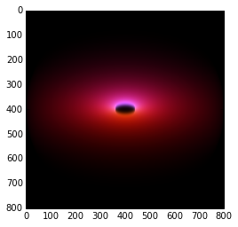
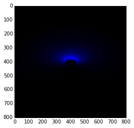
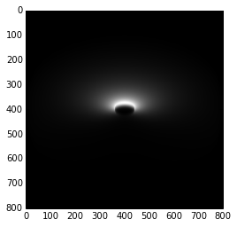
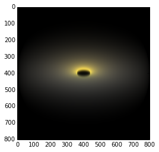
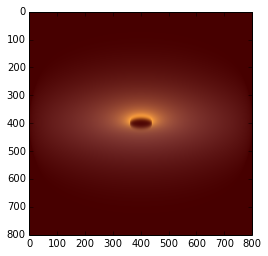

Imports, plotting backend

    import compositing
    import pylab as p
    %matplotlib inline

CLUMPY images (AGN torus emission model, here viewed at i=60 deg from the axis,
and with torus height scale sig=15 degrees)

    fitsfile = './IMG-AA00-TORUSG-sig15-i60-Y010-N01-q0.0-tv005.0.fits.gz'

Load slices (0,3,5). In this CLUMPY model they correspond to 0.1, 2.2, 10 micron
brightness maps

    obj = compositing.ClumpyImage(fitsfile,slices=(0,3,5))

    in fullsize_img: hsimg.shape =  (9, 801, 401)

Instantiate compositing class

    c = compositing.Compositing(obj)

Set the colors of slices, background color is black, normalize per-slice

    c(['b','g','r'],bgcolor='k',normalize_slices=True)

 So pretty...

    ax = p.imshow(c.image,interpolation='bicubic')

Select only one image slice this time (here 0.1 micron). Simply update the
object properties...

    obj.update_slices((0,))

Make it blue; normalize_slices=True is default

    c(['b'],bgcolor='k')

Cool...

    ax = p.imshow(c.image,interpolation='bicubic')

We'll try to make a white image from 3 separate RGB frames...

    obj.update_slices((0,0,0))

bgcolor='k' is default; colors in RGB notation b/c 'green' isn't really green in
pylab

    c([(1,0,0),(0,1,0),(0,0,1)])

 White image

    ax = p.imshow(c.image,interpolation='bicubic')

 Back to one slice only...

    obj.update_slices((0,))

...but simply setting it to 'white'

    c(['w'])

 Same result!

    ax = p.imshow(c.image,interpolation='bicubic')

  Other slices, in different order

    obj.update_slices((6,0,3))

'impure' colors, i.e. not r,g,b

    c(['0.9','#ffb500','y'])

Looks hot & dusty

    ax = p.imshow(c.image,interpolation='bicubic')

Fancy a red background?

    c(['0.9','#ffb500','y'],bgcolor='r')

Here it is:

    ax = p.imshow(c.image,interpolation='bicubic')

